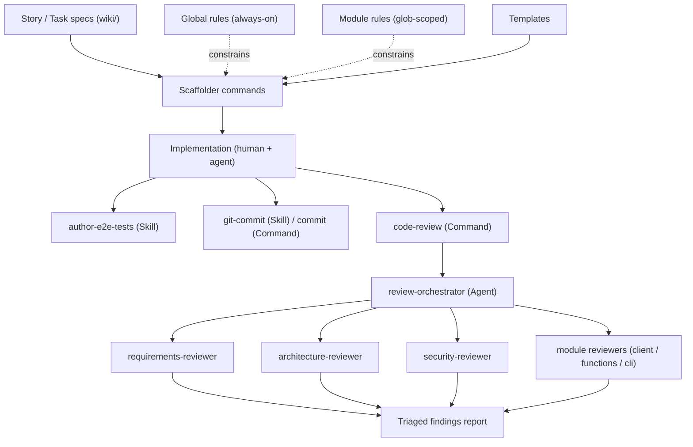
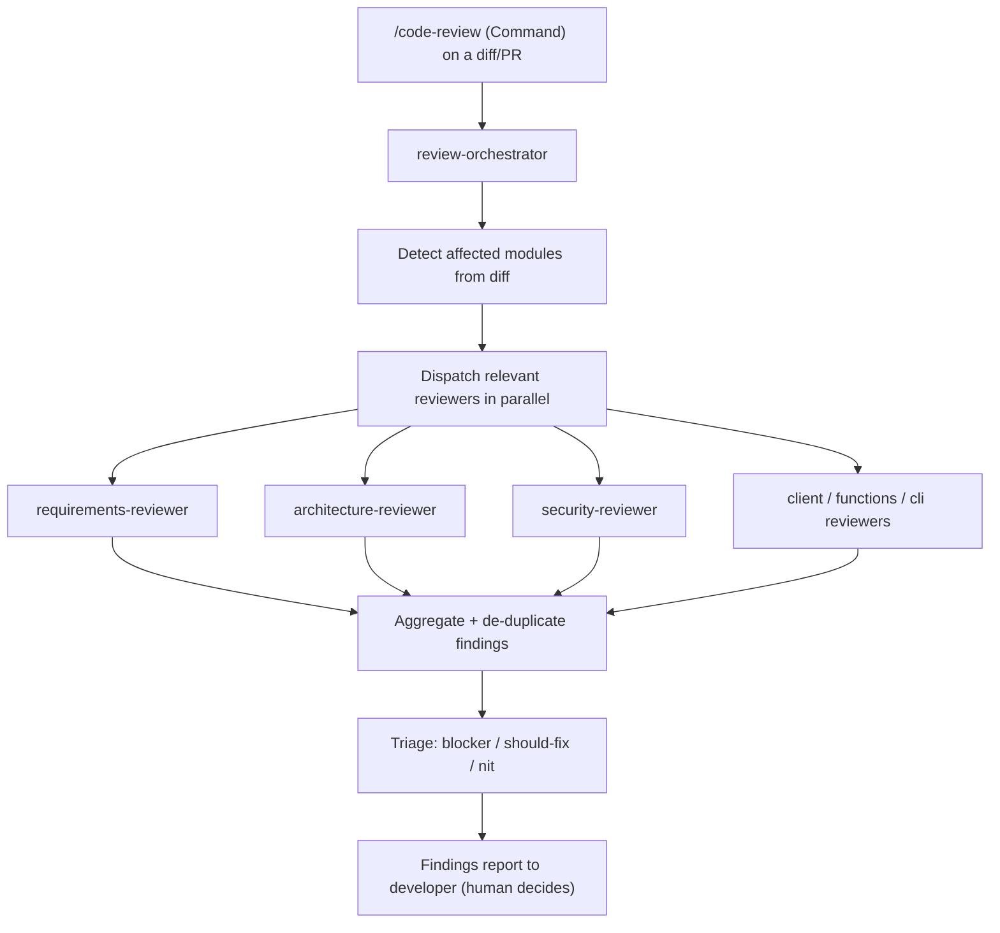

# AI Development Ecosystem — SkillStack

> **Design document, not an implementation.** This file specifies the future
> structure of custom Rules, Skills, Commands, Custom Agents, Templates, and
> optional Cursor Hooks that will support development of SkillStack. Nothing here
> is built yet: no `.cursor/rules`, `.cursor/skills`, `.cursor/commands`,
> `.cursor/agents`, templates, or hooks are created by this document. It is a
> starting point — expect it to evolve as components are actually authored.

## 1. Purpose & Scope

SkillStack is a three-unit monorepo (`client/`, `functions/`, `cli/`) governed by
a layered architecture with a single server-authoritative Firestore gateway (see
[`architecture.md`](architecture.md) and the AD-1..AD-13 invariants in
[`architecture-invariants.md`](architecture-invariants.md)). As the codebase grows,
day-to-day AI-assisted work — implementing tasks, scaffolding units, authoring
tests, reviewing changes — should be driven by a **set of small, focused,
composable capabilities** rather than a few monolithic agents.

This document designs that ecosystem with three hard constraints:

- **Cursor-native.** Every component maps onto a first-class Cursor primitive
  (Rule, Skill, Command, Custom Agent, Cursor Hook) or a plain repo Template.
- **BMAD-independent.** The ecosystem does not extend, wrap, or depend on any
  BMAD asset under `.agents/`. Those are ignored entirely.
- **Composition over monoliths.** No end-to-end "implement a whole story from
  scratch" agent. Capabilities are single-responsibility and chain explicitly,
  with the human in the loop at each gate.

### In scope

Architecture, folder structure, naming conventions, and a full per-component
specification (responsibilities, inputs, outputs, dependencies, invocation
conditions) for every planned component.

### Out of scope

Implementing any Skill, Rule, Command, Agent, or Template; generating prompts for
them; and creating Cursor Hooks (hooks are designed here as an **opt-in** section
only, see [§8](#8-optional-cursor-hooks)).

## 2. Design Principles

| Principle | How the ecosystem honors it |
| --- | --- |
| Maximize reuse | Scaffolders consume shared Templates; rules are referenced (via `@`) rather than copy-pasted; the architecture invariants are **included**, never paraphrased. |
| Minimize duplication | One capability per concern. The AD-1..AD-13 invariants live in exactly one file and are surfaced through a single rule. |
| Separate concerns | Rules constrain, Skills/Commands produce, Agents review, Templates supply boilerplate. No component wears two of these hats. |
| Small composable units | A task flows through discrete steps (scaffold → implement → test → review → commit), each independently invokable. |
| No overlapping responsibilities | Global vs module rules are partitioned by scope; scaffolders are partitioned by unit type; reviewers by concern. |
| Scale with the project | Adding a module or a new implementation-unit type is a documented, repeatable act (see [§10](#10-extensibility)). |
| Human-in-the-loop | Every mutating or irreversible step (commit, deploy, status change, review acceptance) is gated on explicit confirmation. |

## 3. Ecosystem Overview

Five Cursor primitives plus repo Templates, layered by role:

- **Rules** — passive constraints the model always/contextually respects.
- **Skills** — model-invocable capabilities (reusable know-how, auto-triggered by
  relevance).
- **Commands** — user-invoked slash actions (explicit, parameterized).
- **Custom Agents** — reviewer and orchestrator personas with a narrow mandate.
- **Cursor Hooks** *(optional)* — deterministic guardrails on tool events.
- **Templates** — inert boilerplate files that scaffolders instantiate.



**Reading the flow:** rules and templates are ambient inputs (dashed = constrains,
solid = supplies). A developer scaffolds a unit, implements it, authors E2E tests,
then runs review (which fans out to specialized + module reviewers and aggregates a
triaged report) and finally commits. Each box is independently invokable; nothing
forces the full chain.

## 4. Folder Structure & Naming Conventions

```text
.cursor/
  rules/                              # .mdc; frontmatter controls activation, not path
    global/                           #   alwaysApply: true (project-wide)
      architecture-invariants.mdc
      naming-conventions.mdc
      testing-standards.mdc
      documentation-standards.mdc
      git-and-commit-conventions.mdc
      repository-conventions.mdc
    client/                           #   globs: ["client/**"]
      client-architecture.mdc
      client-eleks-ui.mdc
      client-testing.mdc
    functions/                        #   globs: ["functions/**"]
      functions-architecture.mdc
      functions-testing.mdc
    cli/                              #   globs: ["cli/**"]
      cli-architecture.mdc
      cli-testing.mdc
  skills/<kebab-name>/SKILL.md        # model-invocable capabilities
  commands/<kebab-name>.md            # user-invoked slash commands
  agents/<kebab-name>.md              # reviewer + orchestrator agent definitions
  templates/<thing>.template.<ext>    # code-scaffolding boilerplate
  hooks.json                          # OPTIONAL — only if hooks are adopted (§8)
wiki/
  ai-dev-ecosystem.md                 # THIS document
  templates/                          # existing doc templates (story / task / pr)
```

### Naming conventions

| Kind | Convention | Example |
| --- | --- | --- |
| Rule file | `<concern>.mdc`, kebab-case; organized in subfolders by scope | `functions/functions-architecture.mdc` |
| Rule scope (global) | Subfolder `.cursor/rules/global/`; `alwaysApply: true` in frontmatter | `global/testing-standards.mdc` |
| Rule scope (module) | Subfolder per module; `globs: ["<module>/**"]` in frontmatter | `client/client-architecture.mdc` |
| Skill dir | `<kebab-name>/SKILL.md` | `author-e2e-tests/SKILL.md` |
| Command | `/<kebab-name>` (file `<kebab-name>.md`) | `/scaffold-function` |
| Agent | `<role>-reviewer` / `<role>-orchestrator` | `security-reviewer` |
| Template | `<thing>.template.<ext>` | `scaffold-service-store.template.ts` |
| Code files | kebab-case (matches [`architecture.md`](architecture.md) convention) | `github-client.ts` |

**Rule scoping** is expressed in `.mdc` frontmatter, not by path: `alwaysApply: true`
for global rules; `globs: <pattern>` for module rules (auto-attached when a matching
file is in context); `description:` only (no globs, no alwaysApply) for
agent-requestable rules the model pulls in on demand. **Subfolders are for human
organization only** — Cursor activates rules based on frontmatter, not path.

## 5. Project-Wide Components

### 5.1 Global Rules

Always-applied or auto-attached regardless of module. Two already exist
([`code-comments.mdc`](../.cursor/rules/code-comments.mdc),
[`error-handling-logging.mdc`](../.cursor/rules/error-handling-logging.mdc)); the
rest are new.

| Rule | Applies | Responsibility |
| --- | --- | --- |
| `global-architecture-invariants` | always | **Includes** [`architecture-invariants.md`](architecture-invariants.md) verbatim (AD-1..AD-13) so there is no second copy to drift. |
| `code-comments` *(exists)* | always | `NOTE:`-prefixed, English, exception-only comments. |
| `error-handling-logging` *(exists)* | always | Throw `Error` with context + `cause`; correct log levels; no secrets in messages. |
| `global-naming-conventions` | always | File kebab-case; exported Cloud Functions `api` + PascalCase; other cross-cutting naming. |
| `global-git-and-commit-conventions` | always | Git Flow branch model + Conventional Commits per `commitlint.config.js`. |
| `global-testing-standards` | always | Story = E2E, task = unit/integration; AAA structure; where each test lives per package; vitest. |
| `global-documentation-standards` | always | Docs-sync: when scope/decisions change, update the matching `wiki/` file (stories, tasks, invariants). |
| `global-repository-conventions` | always | Monorepo layout, package boundaries, the "`functions/` is the sole Firestore gateway" boundary at repo level. |

### 5.2 E2E Test Authoring — **recommended as a Skill**

**Component:** `author-e2e-tests` (Skill).

**Recommendation & justification.** Implement E2E test authoring as a **Skill**,
not a Custom Agent:

- It is a **single focused capability** (analyze story → decide coverage → generate
  tests), not a coordinator of other capabilities — a Custom Agent's defining value
  (owning a persona and delegating) is unused here.
- Skills are **model-invocable and composable**: `author-e2e-tests` is naturally
  triggered mid-flow (right after implementation) and can be pulled in by other
  capabilities without a mode switch.
- Skills **reference rules cleanly** (`global-testing-standards` + the module
  testing rule), keeping the "how we test" knowledge in one place.
- A Custom Agent would over-scope a per-invocation utility and add ceremony
  (separate persona, separate review loop) with no benefit.

What it does: consumes a story's **E2E scenarios** (already authored in
`wiki/stories/*.md`, e.g. [`story-auth-profile.md`](stories/story-auth-profile.md)),
determines which behaviors need E2E coverage, generates AAA-structured tests from
`e2e-test.template.ts`, defines explicit verification points, references the
module testing rule for placement/conventions, and documents how to execute them.

### 5.3 Review Orchestrator + Specialized Reviewers

**Component:** `review-orchestrator` (Custom Agent). Coordinates post-implementation
review only — it never writes feature code and is explicitly **not** a
story-from-scratch implementer.

Interaction flow:



| Agent | Reviews against |
| --- | --- |
| `requirements-reviewer` | [`requirements.md`](requirements.md) FR/NFR ids + the story's acceptance / E2E scenarios. |
| `architecture-reviewer` | AD-1..AD-13 + the relevant module architecture rule (layering, gateway, dependency direction). |
| `security-reviewer` | Auth-token verification (AD-9), secrets via Secret Manager (AD-10), deny-all rules (AD-3), input validation at boundaries, no secrets in logs. |

The orchestrator delegates module-specific depth to the module reviewers
([§6](#6-module-components)) and merges everything into one triaged report. It never
auto-applies fixes.

## 6. Module Components

Each module (Frontend `client/`, Backend `functions/`, CLI `cli/`) gets its own
rules, scaffolders, and a reviewer, all sharing the global layer above.

### 6.1 Frontend (`client/`)

**Module rules**

| Rule | Responsibility |
| --- | --- |
| `client-architecture` | React Router v8 Data Mode (`loader`/`action`), no 3rd-party state/data lib, all network via `lib/api.ts`, auth via `lib/auth.tsx` context (AD-4). |
| `client-eleks-ui` | ELEKS UI import/usage conventions; delegates to the re-homed `eleks-ui` skill. |
| `client-testing` | RTL conventions, fixture/mocking patterns, unit/integration placement, vitest. |

**Scaffolders**

| Command | Purpose | Template |
| --- | --- | --- |
| `/scaffold-route` | New `routes/<page>/` with component + loader/action wired to `lib/api.ts`. | `scaffold-route.template.tsx` |
| `/scaffold-component` | New presentational/feature component following ELEKS UI conventions. | `scaffold-component.template.tsx` |

**Reviewer:** `client-reviewer` — enforces AD-4, gateway-only fetch, no state lib,
ELEKS UI usage, and `client-testing`.

### 6.2 Backend (`functions/`)

**Service taxonomy** (owned by `functions-architecture`; flat in
`functions/src/services/`, distinguished by suffix):

| Suffix | Archetype | Rule |
| --- | --- | --- |
| `*-store.ts` | Firestore collection adapter — one collection's Zod schema + CRUD; **the only Firestore-touching code** (AD-1/AD-2). Existing: `repositories-store.ts`. | Zod at the store boundary; nothing else imports a Firestore SDK. |
| `*-client.ts` | 3rd-party integration client — wraps one external API (e.g. `github-client.ts` for discovery per AD-6, `anthropic-client.ts` for validation per AD-12), with `defineSecret` wiring (AD-10). No Firestore. | Owns the external call + secret; returns typed data. |
| `*-service.ts` | Domain / orchestration service — composes clients + stores for business logic (e.g. the validation service, AD-12), invoked by thin triggers (endpoint and/or scheduler). | No HTTP parsing, no direct Firestore SDK (goes through a store). |

> **Docs-sync note.** The `-client` / `-service` suffixes are a new convention this
> document introduces; the architecture spine currently names only `*-store.ts`.
> The `global-documentation-standards` rule should drive absorbing this taxonomy
> into [`architecture-invariants.md`](architecture-invariants.md) once adopted.

**Module rules**

| Rule | Responsibility |
| --- | --- |
| `functions-architecture` | Adapter/store/client/service split + suffix taxonomy above; thin `onRequest` adapters (AD-2), auth-token verification (AD-9), Secret Manager (AD-10), deny-all rules (AD-3), calculated-field helpers synchronous (AD-11/AD-13). |
| `functions-testing` | Unit tests co-located, integration tests under `integration-specs/`, mocking conventions, vitest. |

**Scaffolders**

| Command | Purpose | Template |
| --- | --- | --- |
| `/scaffold-function` | Thin HTTP adapter (`functions/<verb>.ts`) wired to exactly one existing service. | `scaffold-function.template.ts` |
| `/scaffold-service-store` | New Firestore collection: Zod schema + CRUD + deny-all `firestore.rules` reminder. | `scaffold-service-store.template.ts` |
| `/scaffold-integration-client` | Typed 3rd-party client + `defineSecret`, no Firestore. | `scaffold-integration-client.template.ts` |
| `/scaffold-domain-service` | Orchestration service composing clients/stores, callable by thin triggers. | `scaffold-domain-service.template.ts` |

> **Database migrations: N/A.** Firestore is schemaless — there is no DDL/migration
> step to scaffold. Schema evolution happens by editing the Zod schema inside the
> relevant `*-store.ts`, governed by `functions-architecture` + `functions-testing`.

**Reviewer:** `functions-reviewer` — flags Firestore access outside a `*-store.ts`,
secret reads outside a `*-client.ts`, business logic in an adapter, missing
auth-token verification, and violations of AD-1/2/3/9/10/11/12/13.

### 6.3 CLI (`cli/`)

**Module rules**

| Rule | Responsibility |
| --- | --- |
| `cli-architecture` | Pipeline-of-single-responsibility-modules per command (AD-8); calls `functions/` for Firestore-touching work; direct-to-GitHub for raw content only (AD-7); local `interfaces.ts` + co-located `.spec.ts`. |
| `cli-testing` | Mocking file system + HTTP, `skills-lock.json` handling, vitest. |

**Scaffolders**

| Command | Purpose | Template |
| --- | --- | --- |
| `/scaffold-command` | New `commands/<verb>/` pipeline (index orchestrator + step modules + interfaces + specs). | `scaffold-cli-command.template.ts` |
| `/scaffold-cli-integration-client` | Typed direct-to-GitHub content client (AD-7) — mirrors the backend integration-client concept for the CLI. | `scaffold-cli-integration-client.template.ts` |

**Reviewer:** `cli-reviewer` — enforces AD-7/AD-8, no Firestore SDK in `cli/`,
pipeline decomposition, and `cli-testing`.

### 6.4 Re-homed existing skills

These non-BMAD skills exist today under `.claude/skills/` and are folded into the
ecosystem, proposed to move to `.cursor/skills/`:

| Skill | Role in ecosystem |
| --- | --- |
| `git-commit` | Conventional Commit drafting + commitlint validation; the engine behind the `/commit` command. |
| `eleks-ui` | ELEKS UI conventions; referenced by the `client-eleks-ui` rule and any UI scaffolding. |
| `check-duplicates` | Copy-paste + semantic duplication detection; invokable during review/refactor. |

## 7. Templates Catalog

Inert boilerplate under `.cursor/templates/`, instantiated by scaffolders. Doc
templates (story / task / pr) already live under [`wiki/templates/`](templates/).

| Template | Consumed by |
| --- | --- |
| `scaffold-function.template.ts` | `/scaffold-function` |
| `scaffold-service-store.template.ts` | `/scaffold-service-store` |
| `scaffold-integration-client.template.ts` | `/scaffold-integration-client` |
| `scaffold-domain-service.template.ts` | `/scaffold-domain-service` |
| `scaffold-route.template.tsx` | `/scaffold-route` |
| `scaffold-component.template.tsx` | `/scaffold-component` |
| `scaffold-cli-command.template.ts` | `/scaffold-command` |
| `scaffold-cli-integration-client.template.ts` | `/scaffold-cli-integration-client` |
| `e2e-test.template.ts` | `author-e2e-tests` skill |
| `unit-test.template.ts` | scaffolders + `functions-testing`/`client-testing`/`cli-testing` |
| `pr-description.template.md` | `/code-review`, commit/PR flow |

## 8. Optional Cursor Hooks

> **Opt-in and not adopted by default.** Hooks are deterministic guardrails on tool
> events. They are documented here for completeness; none should be created without
> an explicit decision to adopt them. If adopted, they live in `.cursor/hooks.json`
> (plus the existing Husky git hooks).

| Hook | Type | Rationale (why it would help) |
| --- | --- | --- |
| Extend `pre-commit` (Husky) | git hook | lint-staged currently covers `client/**` only; extend to `functions/**` + `cli/**` so all packages are linted pre-commit. |
| Extend `pre-push` (Husky) | git hook | Run typecheck across all three packages (today's `npm test` is a stub) to catch breakage before it reaches CI. |
| `beforeShellExecution` | Cursor hook | Matcher on `git push --force`, `firebase deploy`, `rm -rf`; action `ask` (not silent deny), `failClosed: true` — a safety net against irreversible commands. |
| `beforeReadFile` | Cursor hook | Block `.env*` / credential files from entering agent context — belt-and-suspenders alongside AD-10 (secrets live in Secret Manager, never a file). |
| `afterFileEdit` | Cursor hook | Run the relevant lint/format check immediately after an edit lands — tighter feedback loop than commit-time only. |

## 9. Component Interaction & Composition

The ecosystem is deliberately a set of small pieces that chain explicitly:

- **Constrain → Produce → Review → Record.** Rules constrain every step; scaffolders
  + skills produce; agents review; commit/status commands record.
- **Rules are ambient.** Global rules always apply; module rules auto-attach by
  glob. No scaffolder or agent re-states a rule — they reference it, so the rule is
  the single source of truth.
- **Templates are the only boilerplate source.** Scaffolders never inline
  boilerplate; changing a pattern means changing one template.
- **Review fans out, then converges.** `/code-review` → `review-orchestrator` →
  parallel specialized + module reviewers → one triaged report. A developer, not an
  agent, decides what to act on.
- **Human gates everywhere.** Commit (`git-commit`), deploy (`/deploy-check` stops
  short of `firebase deploy`), task-status changes (`/update-task-status`), and
  review acceptance all require explicit confirmation.

**Representative task flow (illustrative, not enforced):** pick a ready task →
`/scaffold-*` the unit(s) → implement → `author-e2e-tests` (if the story adds
E2E-worthy behavior) → `/code-review` → address the triaged report →
`/commit` → `/update-task-status`.

## 10. Extensibility

Adding capabilities is a repeatable act:

- **New implementation-unit type** → add one Template + one `/scaffold-*` Command;
  reference the existing module rule. No new rule needed unless the unit introduces
  a new convention.
- **New module** (e.g. a future `mobile/`) → add `<module>-architecture` +
  `<module>-testing` rules (glob-scoped), the module's scaffolders + templates, and
  a `<module>-reviewer` the orchestrator can dispatch to. The global layer and the
  orchestrator are untouched.
- **New cross-cutting concern** → add one `global-*` rule; existing components
  inherit it automatically.
- **New review dimension** → add a specialized reviewer agent and register it with
  `review-orchestrator`.

## 11. Component Index

Every planned component with the full spec. Legend for **Type**: Rule, Skill,
Command, Custom Agent, Cursor Hook, Template.

### 11.1 Global Rules

#### `global/architecture-invariants.mdc`
- **Type:** Rule (always-applied)
- **Purpose:** Surface AD-1..AD-13 to every task without duplicating them.
- **Responsibilities:** Include [`architecture-invariants.md`](architecture-invariants.md) verbatim.
- **Inputs:** The invariants file.
- **Outputs:** Ambient constraints in context.
- **Dependencies:** `architecture-invariants.md`.
- **Invocation conditions:** Always.
- **Notes:** Include, never paraphrase — prevents a second drifting copy.

#### `code-comments.mdc` *(exists)*
- **Type:** Rule (always-applied)
- **Purpose:** Keep comments exception-only, English, `NOTE:`-prefixed.
- **Responsibilities:** Enforce comment policy across all packages.
- **Inputs:** Source edits.
- **Outputs:** Constraint on generated comments.
- **Dependencies:** None.
- **Invocation conditions:** Always.
- **Notes:** Already implemented; will be moved to `global/` subfolder.

#### `error-handling-logging.mdc` *(exists)*
- **Type:** Rule (always-applied)
- **Purpose:** Consistent, secret-free error/log practice.
- **Responsibilities:** Throw `Error` with context + `cause`; correct log levels; no secrets.
- **Inputs:** Source edits.
- **Outputs:** Constraint on error/log code.
- **Dependencies:** None.
- **Invocation conditions:** Always.
- **Notes:** Already implemented; will be moved to `global/` subfolder.

#### `global/naming-conventions.mdc`
- **Type:** Rule (always-applied)
- **Purpose:** One naming standard repo-wide.
- **Responsibilities:** File kebab-case; Cloud Functions `api`+PascalCase; misc cross-cutting naming.
- **Inputs:** Source edits.
- **Outputs:** Naming constraint.
- **Dependencies:** `architecture.md` conventions table.
- **Invocation conditions:** Always.

#### `global/git-and-commit-conventions.mdc`
- **Type:** Rule (always-applied)
- **Purpose:** Consistent branches + commit messages.
- **Responsibilities:** Git Flow branch model; Conventional Commits per `commitlint.config.js`.
- **Inputs:** Branch/commit actions.
- **Outputs:** Constraint used by `git-commit` / `/commit`.
- **Dependencies:** `commitlint.config.js`.
- **Invocation conditions:** Always.

#### `global/testing-standards.mdc`
- **Type:** Rule (always-applied)
- **Purpose:** One testing philosophy.
- **Responsibilities:** Story = E2E, task = unit/integration; AAA; per-package placement; vitest.
- **Inputs:** Story/task specs, test edits.
- **Outputs:** Constraint used by scaffolders, `author-e2e-tests`, reviewers.
- **Dependencies:** Module testing rules.
- **Invocation conditions:** Always.

#### `global/documentation-standards.mdc`
- **Type:** Rule (always-applied)
- **Purpose:** Keep `wiki/` in sync with reality.
- **Responsibilities:** When scope/decisions change, update the matching wiki file (stories, tasks, invariants).
- **Inputs:** Changes that alter scope/decisions.
- **Outputs:** Docs-sync obligation (e.g. absorbing the service suffix taxonomy).
- **Dependencies:** `wiki/`.
- **Invocation conditions:** Always.

#### `global/repository-conventions.mdc`
- **Type:** Rule (always-applied)
- **Purpose:** Repo-level boundaries.
- **Responsibilities:** Monorepo layout, package boundaries, `functions/`-is-sole-gateway at repo level.
- **Inputs:** Cross-package edits.
- **Outputs:** Boundary constraint.
- **Dependencies:** `architecture.md`.
- **Invocation conditions:** Always.

### 11.2 Module Rules

#### `client/client-architecture.mdc`
- **Type:** Rule (glob: `client/**`)
- **Purpose:** Enforce the frontend architecture (AD-4).
- **Responsibilities:** Router v8 Data Mode, no state/data lib, `lib/api.ts` gateway, `lib/auth.tsx` context.
- **Inputs:** `client/` edits.
- **Outputs:** Constraint for scaffolders + `client-reviewer`.
- **Dependencies:** `global/architecture-invariants.mdc`.
- **Invocation conditions:** Auto-attached on `client/**`.

#### `client/client-eleks-ui.mdc`
- **Type:** Rule (glob: `client/**`)
- **Purpose:** ELEKS UI usage discipline.
- **Responsibilities:** Import/usage conventions; delegate detail to the `eleks-ui` skill.
- **Inputs:** UI edits.
- **Outputs:** Constraint for UI scaffolding.
- **Dependencies:** `eleks-ui` skill.
- **Invocation conditions:** Auto-attached on `client/**`.

#### `client/client-testing.mdc`
- **Type:** Rule (glob: `client/**`)
- **Purpose:** Frontend test conventions.
- **Responsibilities:** RTL, fixtures/mocks, unit/integration placement, vitest.
- **Inputs:** Test edits.
- **Outputs:** Constraint for scaffolders + reviewers.
- **Dependencies:** `global/testing-standards.mdc`.
- **Invocation conditions:** Auto-attached on `client/**`.

#### `functions/functions-architecture.mdc`
- **Type:** Rule (glob: `functions/**`)
- **Purpose:** Enforce backend layering + service taxonomy.
- **Responsibilities:** Adapter/store/client/service split; `*-store.ts`/`*-client.ts`/`*-service.ts` suffixes; AD-2/3/9/10/11/12/13.
- **Inputs:** `functions/` edits.
- **Outputs:** Constraint for backend scaffolders + `functions-reviewer`.
- **Dependencies:** `global/architecture-invariants.mdc`.
- **Invocation conditions:** Auto-attached on `functions/**`.
- **Notes:** Introduces the `-client`/`-service` suffixes pending docs-sync into the spine.

#### `functions/functions-testing.mdc`
- **Type:** Rule (glob: `functions/**`)
- **Purpose:** Backend test conventions.
- **Responsibilities:** Co-located unit specs, `integration-specs/` layout, mocking, vitest.
- **Inputs:** Test edits.
- **Outputs:** Constraint for scaffolders + reviewers.
- **Dependencies:** `global/testing-standards.mdc`.
- **Invocation conditions:** Auto-attached on `functions/**`.

#### `cli/cli-architecture.mdc`
- **Type:** Rule (glob: `cli/**`)
- **Purpose:** Enforce CLI pipeline model + boundaries.
- **Responsibilities:** Pipeline-of-modules (AD-8), gateway calls for Firestore work, direct-to-GitHub content only (AD-7).
- **Inputs:** `cli/` edits.
- **Outputs:** Constraint for CLI scaffolders + `cli-reviewer`.
- **Dependencies:** `global/architecture-invariants.mdc`.
- **Invocation conditions:** Auto-attached on `cli/**`.

#### `cli/cli-testing.mdc`
- **Type:** Rule (glob: `cli/**`)
- **Purpose:** CLI test conventions.
- **Responsibilities:** FS/HTTP mocking, `skills-lock.json` handling, vitest.
- **Inputs:** Test edits.
- **Outputs:** Constraint for scaffolders + reviewers.
- **Dependencies:** `global/testing-standards.mdc`.
- **Invocation conditions:** Auto-attached on `cli/**`.

### 11.3 Skills

#### `author-e2e-tests`
- **Type:** Skill
- **Purpose:** Turn a story's E2E scenarios into executable E2E tests.
- **Responsibilities:** Analyze scenarios, decide coverage, generate AAA tests, define verification points, document execution.
- **Inputs:** A `wiki/stories/*.md` file (E2E scenarios), the relevant module testing rule.
- **Outputs:** E2E test files + a short execution note.
- **Dependencies:** `e2e-test.template.ts`, `global-testing-standards`, module testing rule.
- **Invocation conditions:** After implementing behavior with E2E-worthy scenarios; auto-triggered by relevance or invoked explicitly.
- **Notes:** Chosen as a Skill over a Custom Agent (see [§5.2](#52-e2e-test-authoring--recommended-as-a-skill)).

#### `git-commit` *(re-homed)*
- **Type:** Skill
- **Purpose:** Draft + validate Conventional Commits.
- **Responsibilities:** Analyze diff, draft message, run commitlint, commit only after confirmation.
- **Inputs:** Working-tree diff.
- **Outputs:** A validated commit (on confirmation).
- **Dependencies:** `global-git-and-commit-conventions`, `commitlint.config.js`.
- **Invocation conditions:** When the user wants to commit; engine behind `/commit`.
- **Notes:** Never `--amend`/force-push; never commits secrets.

#### `eleks-ui` *(re-homed)*
- **Type:** Skill
- **Purpose:** Apply ELEKS UI conventions to UI work.
- **Responsibilities:** Component discovery, import rules, styling tokens.
- **Inputs:** UI task/design.
- **Outputs:** ELEKS UI-conformant guidance/code.
- **Dependencies:** `client-eleks-ui` rule.
- **Invocation conditions:** Any React UI work.

#### `check-duplicates` *(re-homed)*
- **Type:** Skill
- **Purpose:** Detect copy-paste + semantic duplication.
- **Responsibilities:** Run detection, produce prioritized report, refactor only on approval.
- **Inputs:** A module/path scope.
- **Outputs:** Duplication report (+ optional refactor).
- **Dependencies:** None hard.
- **Invocation conditions:** During review/refactor.

### 11.4 Commands

#### `/scaffold-function`
- **Type:** Command
- **Purpose:** Scaffold a thin HTTP adapter wired to one existing service.
- **Responsibilities:** Instantiate the adapter template; wire to a chosen service.
- **Inputs:** Verb/name, target service.
- **Outputs:** `functions/src/functions/<verb>.ts` + spec stub.
- **Dependencies:** `scaffold-function.template.ts`, `functions-architecture`.
- **Invocation conditions:** New backend endpoint.

#### `/scaffold-service-store`
- **Type:** Command
- **Purpose:** Scaffold a Firestore collection store.
- **Responsibilities:** Zod schema + CRUD + deny-all rule reminder.
- **Inputs:** Collection/noun name, field shape.
- **Outputs:** `functions/src/services/<noun>-store.ts` + spec stub.
- **Dependencies:** `scaffold-service-store.template.ts`, `functions-architecture`.
- **Invocation conditions:** New Firestore collection.

#### `/scaffold-integration-client`
- **Type:** Command
- **Purpose:** Scaffold a typed 3rd-party client.
- **Responsibilities:** Client wrapper + `defineSecret` wiring; no Firestore.
- **Inputs:** Provider name (e.g. github, anthropic), secret name.
- **Outputs:** `functions/src/services/<provider>-client.ts` + spec stub.
- **Dependencies:** `scaffold-integration-client.template.ts`, `functions-architecture` (AD-10).
- **Invocation conditions:** New external API integration in `functions/`.

#### `/scaffold-domain-service`
- **Type:** Command
- **Purpose:** Scaffold an orchestration service.
- **Responsibilities:** Compose clients/stores; expose logic callable by thin triggers.
- **Inputs:** Service name, collaborators (clients/stores).
- **Outputs:** `functions/src/services/<noun>-service.ts` + spec stub.
- **Dependencies:** `scaffold-domain-service.template.ts`, `functions-architecture` (AD-12).
- **Invocation conditions:** New business-logic flow spanning clients + stores.

#### `/scaffold-route`
- **Type:** Command
- **Purpose:** Scaffold a new frontend route.
- **Responsibilities:** `routes/<page>/` component + loader/action via `lib/api.ts`.
- **Inputs:** Page name, data needs.
- **Outputs:** Route files + spec stub.
- **Dependencies:** `scaffold-route.template.tsx`, `client-architecture`.
- **Invocation conditions:** New page.

#### `/scaffold-component`
- **Type:** Command
- **Purpose:** Scaffold a UI component.
- **Responsibilities:** ELEKS UI-conformant component skeleton.
- **Inputs:** Component name, props.
- **Outputs:** Component + spec stub.
- **Dependencies:** `scaffold-component.template.tsx`, `client-eleks-ui`, `eleks-ui` skill.
- **Invocation conditions:** New component.

#### `/scaffold-command`
- **Type:** Command
- **Purpose:** Scaffold a CLI command pipeline.
- **Responsibilities:** `commands/<verb>/` index + step modules + interfaces + specs.
- **Inputs:** Verb name, pipeline steps.
- **Outputs:** Command pipeline scaffold.
- **Dependencies:** `scaffold-cli-command.template.ts`, `cli-architecture`.
- **Invocation conditions:** New CLI command.

#### `/scaffold-cli-integration-client`
- **Type:** Command
- **Purpose:** Scaffold a direct-to-GitHub content client for the CLI.
- **Responsibilities:** Typed client scoped to known paths (AD-7).
- **Inputs:** Client name, endpoints.
- **Outputs:** CLI integration client + spec stub.
- **Dependencies:** `scaffold-cli-integration-client.template.ts`, `cli-architecture` (AD-7).
- **Invocation conditions:** CLI needs direct external content fetch.

#### `/code-review`
- **Type:** Command
- **Purpose:** Entry point to review.
- **Responsibilities:** Hand a diff/PR to `review-orchestrator`.
- **Inputs:** A diff, branch, or PR ref.
- **Outputs:** Triaged findings report.
- **Dependencies:** `review-orchestrator`.
- **Invocation conditions:** After implementation, before/at PR time.

#### `/commit`
- **Type:** Command
- **Purpose:** Drive the commit flow.
- **Responsibilities:** Invoke `git-commit`; run commitlint; commit on confirmation.
- **Inputs:** Working-tree diff.
- **Outputs:** A validated commit.
- **Dependencies:** `git-commit` skill.
- **Invocation conditions:** When ready to commit.

#### `/deploy-check`
- **Type:** Command
- **Purpose:** Pre-flight before deploy.
- **Responsibilities:** Typecheck/build/test affected packages; stop short of `firebase deploy`.
- **Inputs:** Changed packages.
- **Outputs:** Pass/fail report.
- **Dependencies:** Package scripts.
- **Invocation conditions:** Before a deploy.
- **Notes:** Never runs `firebase deploy` itself.

#### `/update-task-status`
- **Type:** Command
- **Purpose:** Keep task + story status in sync.
- **Responsibilities:** Update a task's frontmatter + its story's Tasks-table row.
- **Inputs:** Task id, new status.
- **Outputs:** Edited `wiki/` files.
- **Dependencies:** `global-documentation-standards`.
- **Invocation conditions:** On task state change; explicit only.

#### `/implement-task` *(optional)*
- **Type:** Command
- **Purpose:** Focused single-task implementation aid.
- **Responsibilities:** Read one task + its story + invariants; implement that task; write its specified tests. Human-gated.
- **Inputs:** One `wiki/tasks/<id>.md`.
- **Outputs:** Implementation + tests for that task.
- **Dependencies:** Module rules, scaffolders, `author-e2e-tests`.
- **Invocation conditions:** When implementing a single task.
- **Notes:** Explicitly NOT a story-level auto-implementer (per constraint: no end-to-end "implement a story from scratch" agent).

### 11.5 Custom Agents

#### `review-orchestrator`
- **Type:** Custom Agent
- **Purpose:** Coordinate post-implementation review.
- **Responsibilities:** Detect affected modules, dispatch relevant reviewers in parallel, aggregate + triage findings.
- **Inputs:** A diff/PR (via `/code-review`).
- **Outputs:** One triaged findings report.
- **Dependencies:** All reviewer agents.
- **Invocation conditions:** After implementation.
- **Notes:** Never writes feature code; never auto-applies fixes.

#### `requirements-reviewer`
- **Type:** Custom Agent
- **Purpose:** Verify changes satisfy requirements.
- **Responsibilities:** Check against FR/NFR ids + story acceptance/E2E scenarios.
- **Inputs:** Diff + linked story/requirements.
- **Outputs:** Requirement findings.
- **Dependencies:** [`requirements.md`](requirements.md), story files.
- **Invocation conditions:** Dispatched by orchestrator.

#### `architecture-reviewer`
- **Type:** Custom Agent
- **Purpose:** Verify architectural conformance.
- **Responsibilities:** Check AD-1..AD-13 + module architecture rules (layering, gateway, dependency direction).
- **Inputs:** Diff + invariants + module rules.
- **Outputs:** Architecture findings.
- **Dependencies:** `architecture-invariants.md`, module architecture rules.
- **Invocation conditions:** Dispatched by orchestrator.

#### `security-reviewer`
- **Type:** Custom Agent
- **Purpose:** Verify security posture.
- **Responsibilities:** Auth-token verification (AD-9), Secret Manager (AD-10), deny-all rules (AD-3), input validation, no secrets in logs.
- **Inputs:** Diff.
- **Outputs:** Security findings.
- **Dependencies:** `architecture-invariants.md`, `error-handling-logging`.
- **Invocation conditions:** Dispatched by orchestrator.

#### `client-reviewer` / `functions-reviewer` / `cli-reviewer`
- **Type:** Custom Agent (one per module)
- **Purpose:** Module-depth conformance review.
- **Responsibilities:** Enforce the module's architecture + testing rules (e.g. `functions-reviewer` flags Firestore access outside `*-store.ts`, secret reads outside `*-client.ts`).
- **Inputs:** Module-scoped diff.
- **Outputs:** Module findings.
- **Dependencies:** The matching module rules.
- **Invocation conditions:** Dispatched by orchestrator when the module is affected.

### 11.6 Templates

All entries below share **Type:** Template. Purpose = supply boilerplate for the
listed consumer; **Inputs** = scaffolder parameters; **Outputs** = an instantiated
file; **Dependencies** = the matching module rule; **Invocation conditions** = when
its scaffolder runs.

| Template | Consumer |
| --- | --- |
| `scaffold-function.template.ts` | `/scaffold-function` |
| `scaffold-service-store.template.ts` | `/scaffold-service-store` |
| `scaffold-integration-client.template.ts` | `/scaffold-integration-client` |
| `scaffold-domain-service.template.ts` | `/scaffold-domain-service` |
| `scaffold-route.template.tsx` | `/scaffold-route` |
| `scaffold-component.template.tsx` | `/scaffold-component` |
| `scaffold-cli-command.template.ts` | `/scaffold-command` |
| `scaffold-cli-integration-client.template.ts` | `/scaffold-cli-integration-client` |
| `e2e-test.template.ts` | `author-e2e-tests` |
| `unit-test.template.ts` | scaffolders + testing rules |
| `pr-description.template.md` | `/code-review`, commit/PR flow |

### 11.7 Cursor Hooks *(optional — see [§8](#8-optional-cursor-hooks))*

| Hook | Type | Invocation condition |
| --- | --- | --- |
| Extended `pre-commit` | git hook | On commit (lint-staged across all packages) |
| Extended `pre-push` | git hook | On push (typecheck all packages) |
| `beforeShellExecution` | Cursor Hook | Before a matched shell command (force-push/deploy/`rm -rf`) |
| `beforeReadFile` | Cursor Hook | Before reading `.env*`/credential files |
| `afterFileEdit` | Cursor Hook | After a file edit lands |

## 12. Out of Scope

This document does **not**: implement any Skill, Rule, Command, Agent, or Template;
generate prompts for them; create any Cursor Hook (hooks remain opt-in); or design
an end-to-end "implement a story from scratch" agent. It is a design starting point
only.
