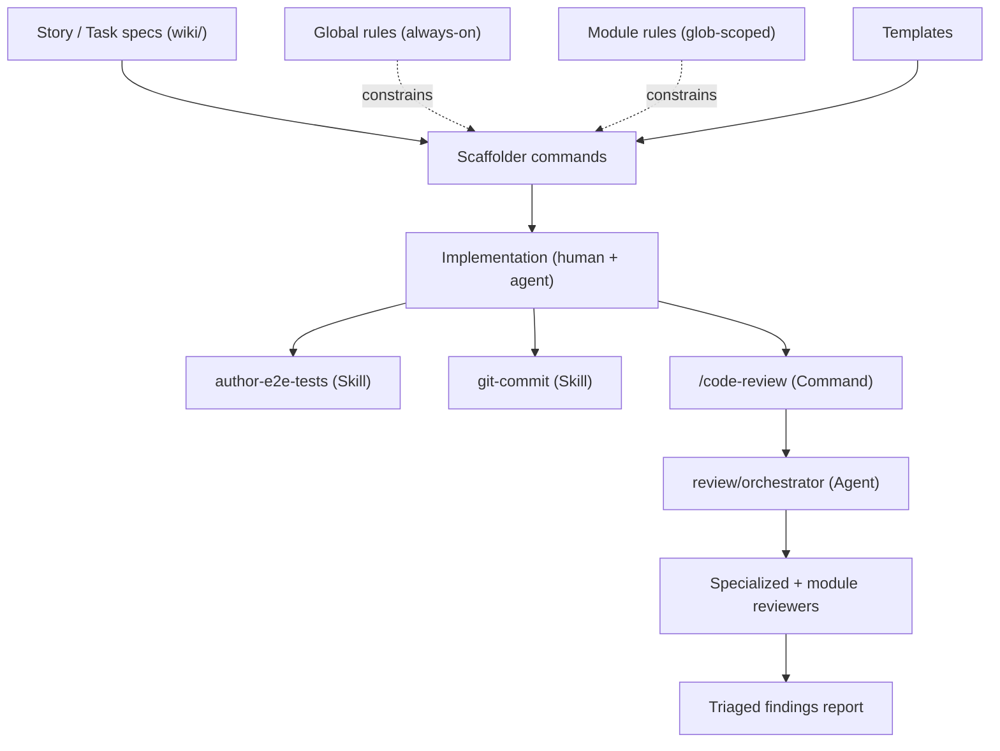
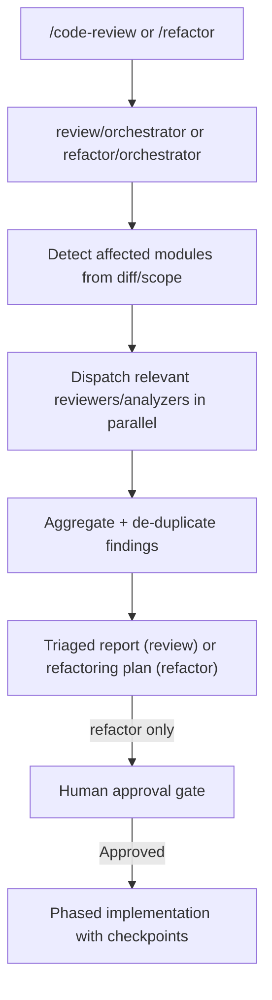

# AI Development Ecosystem — SkillStack

> **Design document, not an implementation.** This file specifies the structure of
> custom Rules, Skills, Commands, Custom Agents, Templates, and optional Cursor Hooks
> for SkillStack. Five rules and three skills exist today (marked _(exists)_); no
> command, agent, template, or hook has been authored yet — see
> [§5](#5-implementation-roadmap) for the build order.

## 1. Purpose & Scope

SkillStack is a three-unit monorepo (`client/`, `functions/`, `cli/`) governed by a
layered architecture with a single server-authoritative Firestore gateway (see
[`architecture.md`](architecture.md) and the AD-1..AD-15 invariants in
[`architecture-invariants.md`](architecture-invariants.md)). As the codebase grows,
day-to-day AI-assisted work — implementing tasks, scaffolding units, authoring
tests, reviewing changes — should be driven by a **set of small, focused,
composable capabilities** rather than a few monolithic agents.

Three hard constraints shape this design:

- **Cursor-native.** Every component maps onto a first-class Cursor primitive
  (Rule, Skill, Command, Custom Agent, Cursor Hook) or a plain repo Template.
- **BMAD-independent.** The ecosystem does not extend, wrap, or depend on any
  BMAD asset under `.agents/`.
- **Composition over monoliths.** Capabilities are single-responsibility and chain explicitly,
  with a human in the loop at each gate.

**In scope:** architecture, folder structure, naming conventions, and a short spec
for every planned component.

**Scope note.** The infra track in the roadmap ([§5](#5-implementation-roadmap)) — a
CI pipeline, linter/`tsconfig` config, a real vulnerability scanner — is not a
Cursor primitive and sits outside the Cursor-native constraint above.

## 2. Design Principles

| Principle                       | How the ecosystem honors it                                                                                                                                    |
| ------------------------------- | -------------------------------------------------------------------------------------------------------------------------------------------------------------- |
| Maximize reuse                  | Scaffolders consume shared Templates; rules are referenced (via `@`) rather than copy-pasted; the architecture invariants are **included**, never paraphrased. |
| Minimize duplication            | One capability per concern. The AD-1..AD-15 invariants live in exactly one file and are surfaced through a single rule.                                        |
| Separate concerns               | Rules constrain, Skills/Commands produce, Agents review, Templates supply boilerplate. No component wears two of these hats.                                   |
| Small composable units          | A task flows through discrete steps (scaffold → implement → test → review → commit), each independently invokable.                                             |
| No overlapping responsibilities | Global vs module rules are partitioned by scope; scaffolders are partitioned by unit type; reviewers by concern.                                               |
| Scale with the project          | Adding a module or a new implementation-unit type is a documented, repeatable act (see [§4.8](#48-composition--extensibility)).                                |
| Human-in-the-loop               | Every mutating or irreversible step (commit, deploy, status change, review acceptance) is gated on explicit confirmation.                                      |

## 3. Topology

### 3.1 Ecosystem Overview

Five Cursor primitives plus repo Templates, layered by role:

- **Rules** — passive constraints the model always/contextually respects.
- **Skills** — model-invocable capabilities, auto-triggered by relevance.
- **Commands** — user-invoked slash actions (explicit, parameterized).
- **Custom Agents** — reviewer and orchestrator personas with a narrow mandate.
- **Cursor Hooks** _(optional)_ — deterministic guardrails on tool events.
- **Templates** — inert boilerplate files that scaffolders instantiate.


```mermaid
flowchart TD
  Spec["Story / Task specs (wiki/)"] --> Scaffold["Scaffolder commands"]
  GlobalRules["Global rules (always-on)"] -.constrains.-> Scaffold
  ModuleRules["Module rules (glob-scoped)"] -.constrains.-> Scaffold
  Templates["Templates"] --> Scaffold
  Scaffold --> Implement["Implementation (human + agent)"]
  Implement --> E2E["author-e2e-tests (Skill)"]
  Implement --> Commit["git-commit (Skill)"]
  Implement --> CodeReview["/code-review (Command)"]
  CodeReview --> Orchestrator["review/orchestrator (Agent)"]
  Orchestrator --> Reviewers["Specialized + module reviewers"]
  Reviewers --> Report["Triaged findings report"]
```

Rules and templates are ambient inputs (dashed = constrains, solid = supplies). A
developer scaffolds a unit, implements it, authors E2E tests, runs review (which
fans out to specialized + module reviewers and aggregates a triaged report), then
commits. Each box is independently invokable — nothing forces the full chain.

### 3.2 Folder Structure

```text
.cursor/
  rules/                              # .mdc; frontmatter controls activation, not path
    global/                           #   project-wide: alwaysApply or repo-wide file-type glob
      architecture-invariants.mdc
      code-comments.mdc               #   exists
      error-handling-logging.mdc      #   exists
      naming-convention.mdc           #   exists — to be extended
      test-conventions.mdc            #   exists — to be extended
      js-import-order.mdc             #   exists
      documentation-standards.mdc
    client/                           #   globs: ["client/**"]
      client-architecture.mdc
      client-testing.mdc
    functions/                        #   globs: ["functions/**"]
      functions-architecture.mdc
      functions-testing.mdc
    cli/                              #   globs: ["cli/**"]
      cli-architecture.mdc
      cli-testing.mdc
  skills/<kebab-name>/SKILL.md        # model-invocable capabilities
  commands/<kebab-name>.md            # user-invoked slash commands (explicit entry points)
  agents/                             # orchestrator + reviewer/analyzer agents
    review/                           #   code review orchestrator + reviewers
      orchestrator.md
      requirements-reviewer.md
      architecture-reviewer.md
      security-reviewer.md
      client-reviewer.md
      functions-reviewer.md
      cli-reviewer.md
    refactor/                         #   refactoring orchestrator + analyzers
      orchestrator.md
      requirements-analyzer.md
      architecture-analyzer.md
      client-analyzer.md
      functions-analyzer.md
      cli-analyzer.md
  templates/<thing>.template.<ext>    # code-scaffolding boilerplate
  hooks.json                          # OPTIONAL — only if hooks are adopted (§4.7)
wiki/
  ai-dev-ecosystem.md                 # THIS document
  templates/                          # existing doc templates (story / task / pr)
```

**Rule scoping** is expressed in `.mdc` frontmatter, not by path — the subfolders
above are for human organization only. Four activation modes, cheapest first:

| Mode                     | Frontmatter                                    | Use when                                                |
| ------------------------ | ---------------------------------------------- | ------------------------------------------------------- |
| Agent-requestable        | `description:` only — no `globs`/`alwaysApply` | The concern applies at decision points, not every edit. |
| Module glob              | `globs: ["<module>/**"]`, `alwaysApply: false` | The concern is one module's.                            |
| Repo-wide file-type glob | `globs: "**/*.<ext>"`, `alwaysApply: false`    | Cross-cutting, but only for certain file types.         |
| Always-on                | `alwaysApply: true`                            | The concern constrains genuinely every edit.            |

Three of the five existing rules use a file-type glob rather than `alwaysApply` —
prefer the cheapest mode that still fires when needed.

**Naming conventions:**

| Kind      | Convention                                            | Example                                                 |
| --------- | ----------------------------------------------------- | ------------------------------------------------------- |
| Rule file | `<concern>.mdc`, kebab-case, in a scope subfolder     | `functions/functions-architecture.mdc`                  |
| Skill dir | `<kebab-name>/SKILL.md`                               | `author-e2e-tests/SKILL.md`                             |
| Command   | `/<kebab-name>` (file `<kebab-name>.md`)              | `/code-review`, `/refactor`                             |
| Agent     | `<flow>/<role>`                                       | `review/orchestrator`, `refactor/requirements-analyzer` |
| Template  | `<thing>.template.<ext>`                              | `scaffold-service-store.template.ts`                    |
| Code file | kebab-case (per [`architecture.md`](architecture.md)) | `github-client.ts`                                      |

Agents are organized in subfolders by workflow (`review/`, `refactor/`); commands
delegate to orchestrators via the Task tool, and orchestrators delegate to
subagents, so no auto-discovery is needed.

## 4. Component Catalog

### 4.1 Global Rules

Applied regardless of module. Five already exist in
[`.cursor/rules/`](../.cursor/rules/); two are new. Two originally-planned rules
(`global-naming-conventions`, `global-testing-standards`) turned out to duplicate
existing ones, so their content is folded in as extensions instead of new files.

| Rule                                | Activation                          | Responsibility                                                                                                                                                                   |
| ----------------------------------- | ----------------------------------- | -------------------------------------------------------------------------------------------------------------------------------------------------------------------------------- |
| `global/architecture-invariants`    | always                              | **Includes** [`architecture-invariants.md`](architecture-invariants.md) verbatim (AD-1..AD-15) so there is no second copy to drift.                                              |
| `code-comments` _(exists)_          | always                              | `NOTE:`-prefixed, English, exception-only comments.                                                                                                                              |
| `error-handling-logging` _(exists)_ | always                              | Throw `Error` with context + `cause`; correct log levels; no secrets. **To extend:** observability (metrics, alerting, dashboards).                                              |
| `naming-convention` _(exists)_      | glob `**/*.{ts,tsx,js,jsx}`         | Identifier naming (no single letters, domain names, case, React handlers). **To extend:** file kebab-case, Cloud Function `api` export naming.                                   |
| `test-conventions` _(exists)_       | glob `**/*.spec.{ts,tsx}`           | One `describe`/file, `it` + `should`, AAA, colocation. **To extend:** story = E2E / task = unit-integration, coverage as diagnostic not merge gate.                              |
| `js-import-order` _(exists)_        | glob `**/*.{js,jsx,mjs,cjs,ts,tsx}` | Import ordering: built-ins, libraries, project, styles.                                                                                                                          |
| `global/documentation-standards`    | always                              | Docs-sync: when scope/decisions change, update the matching `wiki/` file (stories, tasks, invariants) — owns the `-client`/`-service` taxonomy sync in [§4.2](#42-module-rules). |

### 4.2 Module Rules

Each module (`client/`, `functions/`, `cli/`) gets its own rules, scaffolders, and
a reviewer agent, sharing the global layer above.

**`client/`**

| Rule                  | Responsibility                                                                                                                                              |
| --------------------- | ----------------------------------------------------------------------------------------------------------------------------------------------------------- |
| `client-architecture` | React Router v8 Data Mode (`loader`/`action`), no 3rd-party state/data lib, network only via `@shared/firebase-cloude-api`, auth via `lib/auth.tsx` (AD-4). For UI conventions, defers entirely to the `eleks-ui` skill. |
| `client-testing`      | RTL conventions, fixture/mocking patterns, unit/integration placement, vitest.                                                                              |

**`functions/`** — service taxonomy (flat in `functions/src/services/`, by suffix):

| Suffix         | Archetype                                                                                                                 |
| -------------- | ------------------------------------------------------------------------------------------------------------------------- |
| `*-store.ts`   | Firestore collection adapter — the only Firestore-touching code (AD-1/AD-2). E.g. `repositories-store.ts`.                |
| `*-client.ts`  | 3rd-party integration client (e.g. `github-client.ts`, `anthropic-client.ts`); owns `defineSecret` (AD-10). No Firestore. |
| `*-service.ts` | Domain/orchestration service composing clients + stores (AD-12), invoked by thin triggers.                                |

> `-client`/`-service` are a design proposal — AD-2 currently names only
> `*-store.ts`. `global/documentation-standards` should drive absorbing this
> taxonomy into [`architecture-invariants.md`](architecture-invariants.md) once ratified.

| Rule                     | Responsibility                                                                                                                                                                                                                                                                                                                                                                       |
| ------------------------ | ------------------------------------------------------------------------------------------------------------------------------------------------------------------------------------------------------------------------------------------------------------------------------------------------------------------------------------------------------------------------------------ |
| `functions-architecture` | Adapter/store/client/service split above; thin `onRequest` adapters (AD-2), auth-token verification (AD-9), `shareableLink` public exception (AD-14), Secret Manager (AD-10), deny-all rules (AD-3), synchronous calculated fields (AD-11/AD-13), in-memory validation queue (AD-15). Aggregation helpers must tolerate at-least-once trigger re-invocation without double-counting. |
| `functions-testing`      | Co-located unit specs, `integration-specs/` layout, mocking conventions, vitest.                                                                                                                                                                                                                                                                                                     |
| `performance-guidelines` | Firestore query patterns (avoid N+1 reads), pagination, batching — glob-scoped rather than always-on since it only applies here.                                                                                                                                                                                                                                                     |

Firestore is schemaless, so there is no migration step to scaffold — schema
evolution happens by editing the Zod schema inside the relevant `*-store.ts`.

**`cli/`**

| Rule               | Responsibility                                                                                                                                                                                                                                                                                                                                 |
| ------------------ | ---------------------------------------------------------------------------------------------------------------------------------------------------------------------------------------------------------------------------------------------------------------------------------------------------------------------------------------------- |
| `cli-architecture` | Pipeline-of-single-responsibility-modules per command (AD-8); calls `functions/` for Firestore-touching work and skill discovery/content (AD-6/AD-7); local `interfaces.ts` + co-located `.spec.ts`. Multi-file writes (`skills-lock.json` + installed skill directory) commit atomically so an interrupted install can't corrupt local state. |
| `cli-testing`      | Mocking filesystem + HTTP, `skills-lock.json` handling, vitest.                                                                                                                                                                                                                                                                                |

> AD-7 now has the backend push unified metadata + file content to the CLI, so
> `/scaffold-cli-integration-client` may only be useful for rare non-content needs
> (e.g. checking repo existence before calling backend). Decide whether to keep it
> in [Phase 3](#5-implementation-roadmap).

### 4.3 Skills

| Skill                         | Purpose                                                                                                                                                          |
| ----------------------------- | ---------------------------------------------------------------------------------------------------------------------------------------------------------------- |
| `author-e2e-tests`            | Turn a story's E2E scenarios (`wiki/stories/*.md`) into AAA-structured E2E tests from `e2e-test.template.ts`, referencing the module testing rule for placement. |
| `git-commit` _(exists)_       | Draft + validate Conventional Commits; run commitlint; commit only after confirmation. Never `--amend`/force-push, never commits secrets.                        |
| `eleks-ui` _(exists)_         | ELEKS UI component discovery, import rules, styling tokens for any React UI work.                                                                                |
| `check-duplicates` _(exists)_ | Copy-paste + semantic duplication detection; produces a prioritized report, refactors only on approval.                                                          |

**Why `author-e2e-tests` is a Skill, not a Custom Agent:** it's a single focused
capability (analyze → decide coverage → generate tests), not a coordinator of other
capabilities; Skills are model-invocable mid-flow without a mode switch; a Custom
Agent would add persona/review ceremony with no benefit.

### 4.4 Commands

| Command                            | Purpose                                                                                                                         | Template / Dependency                         |
| ---------------------------------- | ------------------------------------------------------------------------------------------------------------------------------- | --------------------------------------------- |
| `/scaffold-function`               | Thin HTTP adapter wired to one existing service.                                                                                | `scaffold-function.template.ts`               |
| `/scaffold-service-store`          | New Firestore collection: Zod schema + CRUD + deny-all `firestore.rules` reminder.                                              | `scaffold-service-store.template.ts`          |
| `/scaffold-integration-client`     | Typed 3rd-party client + `defineSecret`, no Firestore.                                                                          | `scaffold-integration-client.template.ts`     |
| `/scaffold-domain-service`         | Orchestration service composing clients/stores.                                                                                 | `scaffold-domain-service.template.ts`         |
| `/scaffold-route`                  | New `routes/<page>/` component + loader/action via `@shared/firebase-cloude-api`.                                               | `scaffold-route.template.tsx`                 |
| `/scaffold-component`              | ELEKS UI-conformant component skeleton.                                                                                         | `scaffold-component.template.tsx`             |
| `/scaffold-command`                | CLI `commands/<verb>/` pipeline (index + step modules + interfaces + specs).                                                    | `scaffold-cli-command.template.ts`            |
| `/scaffold-cli-integration-client` | Direct-to-GitHub content client for rare non-backend needs (see AD-7 note in [§4.2](#42-module-rules)).                         | `scaffold-cli-integration-client.template.ts` |
| `/code-review`                     | Gather diff/PR context, delegate to `review/orchestrator` via Task tool.                                                        | `review/orchestrator`                         |
| `/refactor`                        | Gather scope + priorities, delegate to `refactor/orchestrator` via Task tool.                                                   | `refactor/orchestrator`                       |
| `/deploy-check` _(deferred)_       | Typecheck/build/test affected packages; stops short of `firebase deploy`.                                                       | package scripts                               |
| `/update-task-status`              | Sync a task's frontmatter + its story's Tasks-table row.                                                                        | `global/documentation-standards`              |
| `/update-changelog` _(deferred)_   | Keep the CLI's changelog in sync with its published npm releases.                                                               | `cli/` release process                        |
| `/implement-task` _(optional)_     | Focused single-task implementation: read task + story + invariants, implement, write tests. Not a story-level auto-implementer. | module rules, scaffolders, `author-e2e-tests` |

### 4.5 Custom Agents

Two orchestrated fan-out flows, both human-gated:


```mermaid
flowchart TD
  Trigger["/code-review or /refactor"] --> Orchestrator["review/orchestrator or refactor/orchestrator"]
  Orchestrator --> Detect["Detect affected modules from diff/scope"]
  Detect --> Fanout["Dispatch relevant reviewers/analyzers in parallel"]
  Fanout --> Aggregate["Aggregate + de-duplicate findings"]
  Aggregate --> Output["Triaged report (review) or refactoring plan (refactor)"]
  Output -->|refactor only| Gate["Human approval gate"]
  Gate -->|Approved| Implement["Phased implementation with checkpoints"]
```

`review/orchestrator` stops at the triaged report — a human decides what to act on,
and it never auto-applies fixes. `refactor/orchestrator` additionally gates on human
approval before implementing, then checkpoints after each phase; it only touches
files in the provided scope.

| Agent                                                              | Purpose                                                                                                                                                 |
| ------------------------------------------------------------------ | ------------------------------------------------------------------------------------------------------------------------------------------------------- |
| `review/orchestrator`                                              | Coordinates post-implementation review; never writes feature code.                                                                                      |
| `review/requirements-reviewer`                                     | Checks changes against [`requirements.md`](requirements.md) FR/NFR ids + story acceptance/E2E scenarios.                                                |
| `review/architecture-reviewer`                                     | Checks AD-1..AD-15 + the relevant module architecture rule.                                                                                             |
| `review/security-reviewer`                                         | Auth-token verification (AD-9), `shareableLink` exception (AD-14), Secret Manager (AD-10), deny-all rules (AD-3), input validation, no secrets in logs. |
| `review/client-reviewer` / `functions-reviewer` / `cli-reviewer`   | Module-depth conformance (e.g. `functions-reviewer` flags Firestore access outside a `*-store.ts`).                                                     |
| `refactor/orchestrator`                                            | Coordinates analysis → plan → phased, approval-gated implementation.                                                                                    |
| `refactor/requirements-analyzer`                                   | Flags requirement gaps and suggests refactorings to close them.                                                                                         |
| `refactor/architecture-analyzer`                                   | Checks AD-1..AD-15; leverages `code-comments`/`error-handling-logging`/`naming-convention` for pattern enforcement.                                     |
| `refactor/client-analyzer` / `functions-analyzer` / `cli-analyzer` | Module-specific refactoring analysis using the module's architecture + testing rules.                                                                   |

**Pattern enforcement:** design patterns, SOLID, and best practices are handled by
`refactor/architecture-analyzer` and the module analyzers via existing
`.cursor/rules/` rather than a separate patterns analyzer. KISS/YAGNI/DRY/SRP/consistency
have no separate rule or checklist either — they're implicit in `review/architecture-reviewer`'s
and `refactor/architecture-analyzer`'s mandate, evaluated the same way AD/pattern conformance is.

### 4.6 Templates

Inert boilerplate under `.cursor/templates/`, instantiated by scaffolders. Doc
templates (story/task/pr) already live under [`wiki/templates/`](templates/).

| Template                                      | Consumed by                        |
| --------------------------------------------- | ---------------------------------- |
| `scaffold-function.template.ts`               | `/scaffold-function`               |
| `scaffold-service-store.template.ts`          | `/scaffold-service-store`          |
| `scaffold-integration-client.template.ts`     | `/scaffold-integration-client`     |
| `scaffold-domain-service.template.ts`         | `/scaffold-domain-service`         |
| `scaffold-route.template.tsx`                 | `/scaffold-route`                  |
| `scaffold-component.template.tsx`             | `/scaffold-component`              |
| `scaffold-cli-command.template.ts`            | `/scaffold-command`                |
| `scaffold-cli-integration-client.template.ts` | `/scaffold-cli-integration-client` |
| `e2e-test.template.ts`                        | `author-e2e-tests`                 |
| `unit-test.template.ts`                       | scaffolders + testing rules        |
| `pr-description.template.md`                  | `/code-review`, commit/PR flow     |

### 4.7 Optional Cursor Hooks

Opt-in, not adopted by default. Deterministic guardrails on tool events, living in
`.cursor/hooks.json` (plus the existing Husky git hooks) if adopted.

| Hook                        | Type        | Rationale                                                                                         |
| --------------------------- | ----------- | ------------------------------------------------------------------------------------------------- |
| Extend `pre-commit` (Husky) | git hook    | lint-staged only covers `client/**` today; extend to `functions/**` + `cli/**`.                   |
| Extend `pre-push` (Husky)   | git hook    | Run typecheck across all three packages before it reaches CI.                                     |
| `beforeShellExecution`      | Cursor hook | Ask (not silent-deny) before `git push --force`, `firebase deploy`, `rm -rf`; `failClosed: true`. |
| `beforeReadFile`            | Cursor hook | Block `.env*`/credential files from entering agent context (belt-and-suspenders alongside AD-10). |
| `afterFileEdit`             | Cursor hook | Run the relevant lint/format check immediately after an edit lands.                               |

### 4.8 Composition & Extensibility

- **Constrain → Produce → Review → Record.** Rules constrain every step; scaffolders/skills produce; agents review; commit/status commands record. Rules are referenced, never restated, so each is a single source of truth.
- **Templates are the only boilerplate source.** Scaffolders never inline boilerplate — changing a pattern means changing one template.
- **Human gates everywhere.** Commit (`git-commit`), deploy (`/deploy-check` stops short of `firebase deploy`), task-status changes, and review/refactor acceptance all require explicit confirmation.
- **Representative flow (illustrative, not enforced):** pick a task → `/scaffold-*` → implement → `author-e2e-tests` (if E2E-worthy) → `/code-review` → address findings → `git-commit` → `/update-task-status`.
- **Adding a unit type** → one Template + one `/scaffold-*` Command, referencing the existing module rule.
- **Adding a module** (e.g. a future `mobile/`) → `<module>-architecture` + `<module>-testing` rules, its scaffolders/templates, and a `review/<module>-reviewer` + `refactor/<module>-analyzer`. The global layer and orchestrators are untouched.
- **Adding a cross-cutting concern** → one `global-*` rule; existing components inherit it automatically.
- **Adding a review/refactor dimension** → one specialized agent under `.cursor/agents/review/` or `refactor/`, registered with its orchestrator.

## 5. Implementation Roadmap

Rules are built before their consumers (scaffolders/agents reference rules rather
than embedding policy) and templates before their scaffolders. A single module
end-to-end (`functions/`) is built before replicating to the other two, to test
whether [§4.8](#48-composition--extensibility)'s "adding a module is repeatable"
claim actually holds. Orchestrators come last — they have nothing to check against
until the rule layer is real.

### Phase 0 — Reconcile what already exists

- **Goal:** make this document and the repo agree before adding anything.
- **Produces:** the five existing rules placed in the target layout with their real activation modes recorded ([§4.1](#41-global-rules)); the three existing skills registered ([§4.3](#43-skills)).
- **Exit criteria:** every rule file on disk appears in [§4](#4-component-catalog) with its actual frontmatter, and vice versa.

### Phase 1 — Global rule layer

- **Goal:** one authoritative source for every cross-cutting policy.
- **Produces:** `global/architecture-invariants.mdc` first, then `global/documentation-standards.mdc`, then the three extensions to existing rules (naming, test strategy, observability).
- **Exit criteria:** no planned scaffolder or agent needs to restate a policy in its own prompt.

### Phase 2 — Vertical pilot on `functions/`

- **Goal:** prove the rule → template → scaffolder → reviewer chain once.
- **Produces, in order:** `functions-architecture` + `functions-testing` rules → the four backend templates + `unit-test.template.ts` → the four `/scaffold-*` backend commands → `review/functions-reviewer`.
- **Exit criteria:** a store, client, service, and adapter scaffolded purely from the commands pass `review/functions-reviewer` with no policy text living inside any scaffolder.
- **Note:** validates the `-client`/`-service` suffix taxonomy in practice before the docs-sync into AD-2.

### Phase 3 — Replicate to `client/` and `cli/`

- **Goal:** confirm the pattern generalizes.
- **Produces:** client + CLI module rules, templates, scaffolders, and their reviewers.
- **Exit criteria:** replication required no change to the global layer.
- **Decision to resolve here:** whether `/scaffold-cli-integration-client` survives AD-7 ([§4.2](#42-module-rules)).

### Phase 4 — Orchestrated agent flows

- **Goal:** the fan-out review and refactor workflows.
- **Produces:** `review/orchestrator` (incl. PR size/scope pre-check) + the three cross-cutting reviewers + `/code-review` + `pr-description.template.md`; then `refactor/orchestrator` + analyzers + `/refactor`.
- **Exit criteria:** the orchestrator emits one de-duplicated triaged report, and every reviewer cites rule/AD ids rather than restating their content.
- **Note:** module reviewers/analyzers are built in Phases 2-3 as part of each vertical slice; this phase adds only the orchestrators and cross-cutting reviewers.

### Phase 5 — Deferred

- `/update-changelog` — keep the CLI's changelog in sync with its published npm releases.
- `/deploy-check` — typecheck/build/test affected packages, stopping short of `firebase deploy`; deferred until the shared `verify` script it should call ([Infra track](#infra-track--parallel-outside-the-cursor-native-constraint)) exists.

### Infra track — parallel, outside the Cursor-native constraint

This work isn't a Rule/Skill/Command/Agent — it's plain repo tooling that several
of the phases above quietly assume exists. None of it is built today:

- **No real CI yet.** The two existing GitHub workflows only build the client for
  hosting deploys; nothing runs lint/typecheck/test on a PR.
- **Lint is a no-op today.** `lint:eslint` and `lint:editorconfig` are `echo` stubs,
  so the `pre-commit` hook effectively only runs Prettier.
- **TypeScript `strict` mode is inconsistent.** Only `functions/` has it on;
  `client/` and `cli/` don't.
- **No complexity/size limits.** `eslint.config.js` has no `complexity` or
  `max-lines` rules to catch code that's grown too large or tangled.
- **`/security-scan` has no tooling behind it yet** — the command is named in the
  catalog, but a real SAST + dependency-CVE scanner still needs to be chosen.

**How `/deploy-check` and CI stay in sync:** both need one shared answer to "what
must pass," so a single root `verify` script (lint + typecheck + test across all
three packages) is the canonical definition — not a rule, since CI can't read a
`.mdc` file. Neither `/deploy-check` nor the CI pipeline should be finalized before
this script exists, or they risk enforcing two different definitions of "green."
