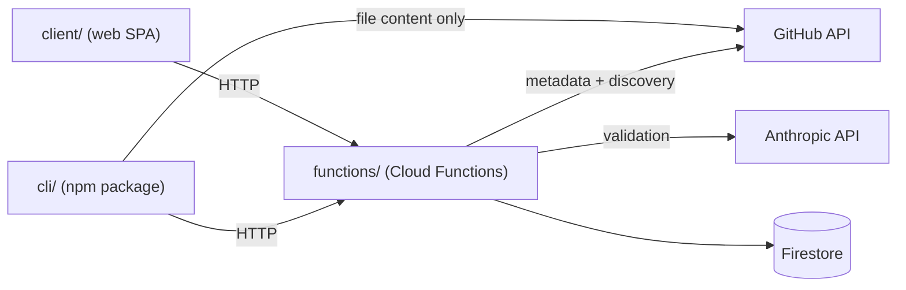

# Architecture Invariants — SkillStack

### AD-1 — Cloud Functions is the sole Firestore gateway

- **Binds:** all
- **Prevents:** `client/` or `cli/` reading/writing Firestore directly and independently drifting from the calculated/aggregate fields or the collection shape.
- **Rule:** Only `functions/src/services/*.ts` holds Firestore access (via `firebase-admin`). Neither `client/` nor `cli/` ever import a Firestore SDK.

### AD-2 — Backend layering: thin adapter over a single-owner store

- **Binds:** functions/
- **Prevents:** HTTP concerns, business rules, and Firestore access bleeding into one undifferentiated file.
- **Rule:** `functions/src/functions/<verb>.ts` parses the request, calls exactly one `services/<noun>-store.ts` function, and maps the result/error to an HTTP response. `services/<noun>-store.ts` owns that collection's Zod schema and is the only place `.parse()`/Firestore calls for it happen.

### AD-3 — `firestore.rules` is deny-all

- **Binds:** platform
- **Prevents:** owner-based rule logic that duplicates checks already done in `functions/` and can drift from them.
- **Rule:** Every collection's rule is `allow read, write: if false`. Firestore is reachable only through the admin SDK inside `functions/` (AD-1), so there is nothing for client-facing rules to arbitrate.

### AD-4 — Client: router-owned data, no state library

- **Binds:** client/
- **Prevents:** each new page inventing its own data-fetching/caching approach or pulling in a state-management library piecemeal.
- **Rule:** Routing and server-state both go through React Router v8 in Data Mode (`createBrowserRouter`, route `loader`/`action`). No 3rd-party state or data-fetching library (TanStack Query included) is used. The current logged-in user is exposed via one React Context (`lib/auth.tsx`) wrapping Firebase Auth's `onAuthStateChanged` — plumbing, not a state library. Every network call to `functions/` goes through `lib/api.ts`; no component calls `fetch()` directly.

### AD-5 — No shared types package between `cli/` and `functions/`, but every contract is documented by example

- **Binds:** cli/, functions/
- **Prevents:** reintroducing the coupling that motivated dropping `shared/`; and, without that shared code, two hand-written implementations of one JSON shape quietly disagreeing on field names, casing, or array-vs-map structure.
- **Rule:** `cli/` and `functions/` each define their own request/response types for the HTTP contract between them — no shared package. In place of shared types: every cross-package endpoint's request/response is written down as a concrete sample JSON object, not just described in English — the sample is the contract both sides build against.

### AD-6 — Skill discovery lives only in `functions/`

- **Binds:** cli/, functions/, client/
- **Prevents:** two independent implementations of the SKILL.md/depth-3 rule (one in `cli/`, one in `functions/`) silently disagreeing on what counts as a skill.
- **Rule:** The discovery algorithm — walk a GitHub repo tree, match `SKILL.md` up to nesting depth 3, then take the whole matched directory regardless of its own depth (rule per `wiki/project_description.md`) — is implemented once, in a `functions/` Cloud Function (`scanRepository`-style). Plain deterministic code; no LLM involved. Both the CLI (no `--skill` given) and the web upload flow call this one function and get back metadata only: skill list/paths, commit hash, validation status, README blurb — never file content.

### AD-7 — `cli/` keeps direct-to-GitHub content download

- **Binds:** cli/
- **Prevents:** file-transfer bandwidth for every install funneling through `functions/` egress/quota instead of each user's own connection to GitHub.
- **Rule:** Once `cli/` has a skill path (from AD-6's `scanRepository` response or the user's `--skill` flag), it fetches that path's file content directly from the GitHub API itself (existing `download-repo.ts` blob-fetch style) — scoped to the known path, not a blind repo-wide walk.

### AD-8 — CLI layering: pipeline of single-responsibility modules

- **Binds:** cli/
- **Prevents:** a command's steps (parse → fetch → write) collapsing into one undifferentiated function.
- **Rule:** `commands/<verb>/index.ts` orchestrates a pipeline of single-responsibility modules, with a local `interfaces.ts` for that command's types and a co-located `.spec.ts` per module.

### AD-9 — Owner-scoped functions verify a Firebase Auth ID token; endpoints stay `onRequest`

- **Binds:** functions/, client/
- **Prevents:** some endpoints adopting `onCall` (a different client SDK/protocol) while others stay `onRequest`, breaking AD-4's single `lib/api.ts` gateway assumption; and owner checks being implemented ad hoc per endpoint.
- **Rule:** All Cloud Functions stay `onRequest` (per AD-2). An endpoint that mutates or reads owner-scoped data (upload, on-demand validate) requires an `Authorization: Bearer <Firebase ID token>` header, verified server-side via the admin SDK's `verifyIdToken` before the service layer runs. Public read endpoints (catalog search, list) require no auth header.

### AD-10 — Secrets via Firebase Functions v2 Secret Manager

- **Binds:** functions/
- **Prevents:** an Anthropic or GitHub API token being hardcoded or committed because there was no established pattern.
- **Rule:** Any credential `functions/` needs (Anthropic API key; a GitHub token, if/when one is needed for rate limits) is declared with `defineSecret` (Firebase Functions v2 Secret Manager integration) and injected at runtime — never a literal in source or a plain environment variable in config files.

### AD-11 — Install-count aggregation: synchronous, via a shared helper

- **Binds:** functions/ (and any future writer of a skill's install count)
- **Prevents:** two writers of the repo-level calculated install count reimplementing the roll-up differently; and telemetry's write being conflated with validation-status logic (they're independent fields, independent helpers).
- **Rule:** `repositories-store.ts` exports `recalculateInstallCount(repoId)` — sums the `installCount` of every skill under that repo and writes the total onto the repository doc. The telemetry function calls it synchronously, right after incrementing a skill's own install count, in the same function invocation. No Firestore trigger.

### AD-12 — Validation invocation: one service, two thin triggers

- **Binds:** functions/
- **Prevents:** the daily scheduled validation and the on-demand "Validate" button drifting into two separate implementations of the actual check.
- **Rule:** One service holds the real validation logic (fetch latest from GitHub, call the Anthropic SDK, write `findings`). Two thin triggers both call it: an owner-scoped `onRequest` endpoint (AD-9) for on-demand, and a daily scheduled Cloud Function for the automatic sweep.

### AD-13 — Validation-status aggregation: synchronous, via a shared helper

- **Binds:** functions/ (and any future writer of a skill's validation status)
- **Prevents:** the same divergence AD-11 prevents for install count, applied to validation status: two writers reimplementing the roll-up differently, or the helper being conflated with the install-count one (they're independent fields, independent helpers, per AD-11's split).
- **Rule:** `repositories-store.ts` exports `recalculateValidationStatus(repoId)` — `validated` only if every skill has zero critical findings, otherwise `failed`; `pending` skills not yet checked don't affect the calculation. The validation service calls it synchronously, right after writing a skill's `findings`, in the same function invocation. No Firestore trigger — same convention as AD-11.
