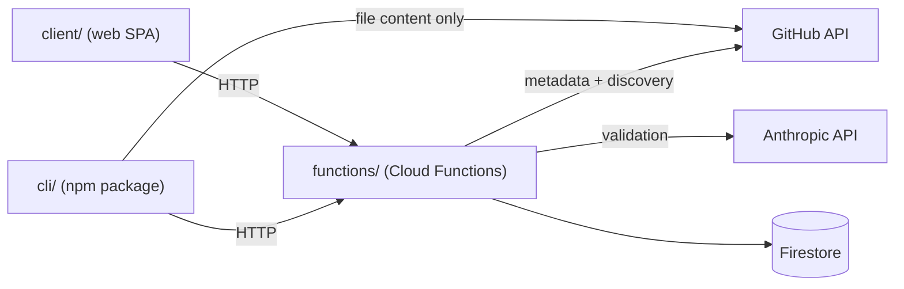

# Architecture Spine — SkillStack

## Design Paradigm

**Layered architecture with a single server-authoritative gateway.** Three independently-deployed
units — `client/` (web SPA), `cli/` (published npm package), `functions/` (backend) — but only
one of them, `functions/`, ever touches Firestore. Every other unit is a consumer that goes
through it. Within `functions/` itself, a thin **adapter layer** does HTTP in/out and nothing
else; a **service/store layer** owns one Firestore collection each (its Zod schema + CRUD); no
other code touches Firestore.

| Layer | Namespace | Owns |
| --- | --- | --- |
| HTTP adapter | `functions/src/functions/*.ts` | Parse request, call one service, map errors to HTTP status. No Firestore, no business rules. |
| Service / store | `functions/src/services/*-store.ts` | One Firestore collection's Zod schema + CRUD. The only code with Firestore access. |
| Client gateway client | `client/src/lib/api.ts` | The one place the SPA calls `functions/`. No component calls `fetch()` directly. |
| CLI gateway calls | `cli/src/commands/**` | Calls `functions/` for anything Firestore-touching; talks to GitHub directly only for raw file content (see AD-6, AD-7). |

## Invariants & Rules



### AD-1 — Cloud Functions is the sole Firestore gateway

- **Binds:** all
- **Prevents:** `client/` or `cli/` reading/writing Firestore directly and independently drifting from the calculated/aggregate fields or the collection shape.
- **Rule:** Only `functions/src/services/*.ts` holds Firestore access (via `firebase-admin`). Neither `client/` nor `cli/` ever import a Firestore SDK.

### AD-2 — Backend layering: thin adapter over a single-owner store

- **Binds:** functions/
- **Prevents:** HTTP concerns, business rules, and Firestore access bleeding into one undifferentiated file.
- **Rule:** `functions/src/functions/<verb>.ts` parses the request, calls exactly one `services/<noun>-store.ts` function, and maps the result/error to an HTTP response. `services/<noun>-store.ts` owns that collection's Zod schema and is the only place `.parse()`/Firestore calls for it happen. [ADOPTED] — ratified from `write-repository.ts` / `get-repositories-list.ts` / `repositories-store.ts`.

### AD-3 — `firestore.rules` is deny-all

- **Binds:** platform (SS-102)
- **Prevents:** owner-based rule logic that duplicates checks already done in `functions/` and can drift from them.
- **Rule:** Every collection's rule is `allow read, write: if false`. Firestore is reachable only through the admin SDK inside `functions/` (AD-1), so there is nothing for client-facing rules to arbitrate.

### AD-4 — Client: router-owned data, no state library

- **Binds:** client/
- **Prevents:** each new page inventing its own data-fetching/caching approach or pulling in a state-management library piecemeal.
- **Rule:** Routing and server-state both go through React Router v8 in Data Mode (`createBrowserRouter`, route `loader`/`action`). No 3rd-party state or data-fetching library (TanStack Query included) is used. The current logged-in user is exposed via one React Context (`lib/auth.tsx`) wrapping Firebase Auth's `onAuthStateChanged` — plumbing, not a state library. Every network call to `functions/` goes through `lib/api.ts`; no component calls `fetch()` directly. **Not yet installed** — `react-router` is not in `client/package.json` today; this is the adopted choice for when routing is built, not a description of current code.

### AD-5 — No shared types package between `cli/` and `functions/`, but every contract is documented by example

- **Binds:** cli/, functions/
- **Prevents:** reintroducing the coupling that motivated dropping `shared/`; and, without that shared code, two hand-written implementations of one JSON shape quietly disagreeing on field names, casing, or array-vs-map structure.
- **Rule:** `cli/` and `functions/` each define their own request/response types for the HTTP contract between them — no shared package. [ADOPTED] — safe because `skillstack` is always invoked via `npx` (confirmed), so every run resolves the latest published CLI version; there is no old-version-in-the-wild drift to guard against. In place of shared types: every cross-package endpoint's request/response is written down as a concrete sample JSON object in that endpoint's task file (`wiki/tasks/`), not just described in English — the sample is the contract both sides build against.

### AD-6 — Skill discovery lives only in `functions/`

- **Binds:** cli/, functions/, client/
- **Prevents:** two independent implementations of the SKILL.md/depth-3 rule (one in `cli/`, one in `functions/`) silently disagreeing on what counts as a skill.
- **Rule:** The discovery algorithm — walk a GitHub repo tree, match `SKILL.md` up to nesting depth 3, then take the whole matched directory regardless of its own depth (rule per `wiki/project_description.md`) — is implemented once, in a `functions/` Cloud Function (`scanRepository`-style). Plain deterministic code; no LLM involved. Both the CLI (no `--skill` given) and the web upload flow call this one function and get back metadata only: skill list/paths, commit hash, validation status, README blurb — never file content. **Migration note:** `cli/src/commands/pull/download-repo.ts` already contains a generic (non-SKILL.md-aware) tree walk that predates this AD; it does not yet implement the depth-3/SKILL.md match, so nothing existing actually contradicts this rule yet, but the task rewrite (see project tasks) must route skill *discovery* through `scanRepository` rather than growing a second implementation inside `download-repo.ts`.

### AD-7 — `cli/` keeps direct-to-GitHub content download

- **Binds:** cli/
- **Prevents:** file-transfer bandwidth for every install funneling through `functions/` egress/quota instead of each user's own connection to GitHub.
- **Rule:** Once `cli/` has a skill path (from AD-6's `scanRepository` response or the user's `--skill` flag), it fetches that path's file content directly from the GitHub API itself (existing `download-repo.ts` blob-fetch style) — scoped to the known path, not a blind repo-wide walk.

### AD-8 — CLI layering: pipeline of single-responsibility modules

- **Binds:** cli/
- **Prevents:** a command's steps (parse → fetch → write) collapsing into one undifferentiated function.
- **Rule:** `commands/<verb>/index.ts` orchestrates a pipeline of single-responsibility modules, with a local `interfaces.ts` for that command's types and a co-located `.spec.ts` per module. [ADOPTED] — ratified from `commands/pull/*`.

### AD-9 — Owner-scoped functions verify a Firebase Auth ID token; endpoints stay `onRequest`

- **Binds:** functions/, client/
- **Prevents:** some endpoints adopting `onCall` (a different client SDK/protocol) while others stay `onRequest`, breaking AD-4's single `lib/api.ts` gateway assumption; and owner checks being implemented ad hoc per endpoint.
- **Rule:** All Cloud Functions stay `onRequest` (per AD-2). An endpoint that mutates or reads owner-scoped data (upload, on-demand validate) requires an `Authorization: Bearer <Firebase ID token>` header, verified server-side via the admin SDK's `verifyIdToken` before the service layer runs. Public read endpoints (catalog search, list) require no auth header.

### AD-10 — Secrets via Firebase Functions v2 Secret Manager

- **Binds:** functions/
- **Prevents:** an Anthropic or GitHub API token being hardcoded or committed because there was no established pattern.
- **Rule:** Any credential `functions/` needs (Anthropic API key; a GitHub token, if/when one is needed for rate limits) is declared with `defineSecret` (Firebase Functions v2 Secret Manager integration) and injected at runtime — never a literal in source or a plain environment variable in config files.

### AD-11 — Install-count aggregation: synchronous, via a shared helper

- **Binds:** functions/ (SS-504, and any future writer of a skill's install count)
- **Prevents:** two writers of the repo-level calculated install count reimplementing the roll-up differently; and telemetry's write being conflated with validation-status logic (they're independent fields, independent helpers).
- **Rule:** `repositories-store.ts` exports `recalculateInstallCount(repoId)` — sums the `installCount` of every skill under that repo and writes the total onto the repository doc. SS-504 (telemetry) calls it synchronously, right after incrementing a skill's own install count, in the same function invocation. No Firestore trigger. [ADOPTED] — only one writer exists today, so the "a future writer might forget to call it" risk this trades away is small and auditable.

### AD-12 — Validation invocation: one service, two thin triggers

- **Binds:** functions/ (SS-401, SS-402)
- **Prevents:** the daily scheduled validation and the on-demand "Validate" button drifting into two separate implementations of the actual check.
- **Rule:** SS-401 is the one service with the real validation logic (fetch latest from GitHub, call the Anthropic SDK, write `findings`). SS-402 is two thin triggers that both call it: an owner-scoped `onRequest` endpoint (AD-9) for on-demand, and a daily scheduled Cloud Function for the automatic sweep. [ADOPTED] — already how SS-401/SS-402 were written; recorded here so Deferred doesn't drift again.

### AD-13 — Validation-status aggregation: synchronous, via a shared helper

- **Binds:** functions/ (SS-401, and any future writer of a skill's validation status)
- **Prevents:** the same divergence AD-11 prevents for install count, applied to validation status: two writers reimplementing the roll-up differently, or the helper being conflated with the install-count one (they're independent fields, independent helpers, per AD-11's split).
- **Rule:** `repositories-store.ts` exports `recalculateValidationStatus(repoId)` — `validated` only if every skill has zero critical findings, otherwise `failed`; `pending` skills not yet checked don't affect the calculation. SS-401 calls it synchronously, right after writing a skill's `findings`, in the same function invocation. No Firestore trigger — same convention as AD-11. [ADOPTED] — decided over AD-11's install-count precedent: one writer today, so the "a future writer might forget" risk is small and auditable; revisit toward an async `onWrite` trigger only if a second independent writer of validation status appears.

## Consistency Conventions

| Concern | Convention |
| --- | --- |
| Naming | Files: kebab-case. Exported Cloud Functions: `api` + PascalCase (`apiWriteRepository`, `apiGetRepositoriesList`). |
| Data & formats | Firestore doc id = auto-generated ref id. Errors: JSON body `{ error: string }` with a meaningful HTTP status (400 invalid payload, 500 unexpected failure). Zod validates at the store boundary (inside `services/*-store.ts`), never in the adapter. |
| State & cross-cutting | Logging via `firebase-functions/logger` (structured). No direct Firestore/Firebase-admin credentials outside `functions/`. |

## Stack

| Name | Version |
| --- | --- |
| TypeScript | `~6.0.2` (root/client), `^5.9.3` (cli), `^7.0.2` (functions) — three independently-managed packages, versions not unified |
| Node | 24 (`.nvmrc`; `functions` engines pin `24`) |
| React | ^19.2.6 |
| Vite | ^8.0.12 |
| React Router | ^8 (Data Mode) — verified current 2026, requires Node 22+/Vite 7+/React 19+; this repo's Node/Vite/React already clear all three. **Not yet a dependency** — adopted per AD-4 for when routing is built. |
| Firebase (client SDK) | ^12.15.0 |
| firebase-admin / firebase-functions | ^13.6.0 / ^7.0.0 |
| Firestore | via firebase-admin, v2 Cloud Functions (`onRequest`) |
| Zod | ^4.4.3 |
| commander | ^15.0.0 (cli) |
| tsup | ^8.5.1 (cli build) |
| vitest | `^4.1.10` (root/client, cli). **Gap in `functions/`:** its `package.json` scripts invoke vitest but declare no vitest devDependency and it has its own isolated lockfile — pre-existing issue, unrelated to this spine, worth fixing separately. |
| eleks-ui | vendored under `client/src/components/eleks-ui` |

## Structural Seed

```text
{repo-root}/
  client/       # React 19 + Vite SPA. src/routes/<page>/ (component + loader/action),
                # src/lib/api.ts (gateway client), src/lib/auth.tsx, src/lib/firebase.ts,
                # src/components/eleks-ui/ (vendored)
  functions/    # Cloud Functions backend — sole Firestore gateway (AD-1)
    src/functions/   # thin HTTP adapters (AD-2)
    src/services/    # one *-store.ts per Firestore collection (AD-2)
  cli/          # separate npm package (skillstack-cli), tsup build
    src/commands/<verb>/   # pipeline of single-responsibility modules (AD-8)
  wiki/         # project_description.md, architecture.md (this file), stories/, tasks/
```

**Deployment & environments.** Single Firebase project (`skillstack-724d8`), no separate
staging project. Hosting auto-deploys via GitHub Actions on push to `main`
(`firebase-hosting-merge.yml`) plus PR preview channels (`firebase-hosting-pull-request.yml`).
Cloud Functions deploy manually today (`npm run deploy` in `functions/`) — not yet wired into
CI (known gap, not a decision).

## Requirements Traceability

FR/NFR ids extracted from `wiki/project_description.md`. Each is linkable (`#fr-cli1`
etc.) so stories/tasks can cite the exact requirement instead of paraphrasing it.

| id | Requirement | Story |
| --- | --- | --- |
| <a id="fr-cli1"></a>FR-CLI1 | `npx skillstack add <repo-url> [--skill <name>]` installs skill(s) into the local project | story-cli-install-new |
| <a id="fr-cli2"></a>FR-CLI2 | Discover skills up to nesting depth 3; deeper not allowed | story-cli-install-new |
| <a id="fr-cli3"></a>FR-CLI3 | Once `SKILL.md` found, take the whole skill directory (any sub-depth) | story-cli-install-new |
| <a id="fr-cli4"></a>FR-CLI4 | No `--skill` given → list all discovered skills, user picks one or more | story-cli-install-new |
| <a id="fr-cli5"></a>FR-CLI5 | Backend check: repo unknown → warn "unvalidated," install anyway if user agrees | story-cli-install-new |
| <a id="fr-cli6"></a>FR-CLI6 | Repo known + validated + commit changed → let user choose stored (validated) vs. latest | story-cli-install-update |
| <a id="fr-cli7"></a>FR-CLI7 | Repo known + not validated + commit changed → just install latest, no choice prompt | story-cli-install-update |
| <a id="fr-cli8"></a>FR-CLI8 | After scan, prompt for target platform(s) — Claude/Cursor/Copilot, multi-select — install to the right folder per platform | story-cli-install-new |
| <a id="fr-cli9"></a>FR-CLI9 | After install, fire telemetry — record the install, mark repo/skill(s) pending validation | story-cli-install-new (reused by story-cli-install-update) |
| <a id="fr-ui1"></a>FR-UI1 | Anyone can search validated skills (no login required) | story-catalog-search |
| <a id="fr-ui2"></a>FR-UI2 | Search covers both individual skills and whole repositories | story-catalog-search |
| <a id="fr-ui3"></a>FR-UI3 | GitHub login | story-auth-profile |
| <a id="fr-ui4"></a>FR-UI4 | Profile page shows GitHub info | story-auth-profile |
| <a id="fr-ui5"></a>FR-UI5 | Logged-in user uploads a repo/skill via URL → appears pending | story-upload-repo |
| <a id="fr-ui6"></a>FR-UI6 | "Validate" button triggers validation | story-validate-skill |
| <a id="fr-ui7"></a>FR-UI7 | Shows status + structured critical issues vs. non-critical recommendations | story-validate-skill |
| <a id="fr-ui8"></a>FR-UI8 | Manual validation always re-fetches latest from GitHub, never cache | story-validate-skill |
| <a id="fr-be1"></a>FR-BE1 | One `repositories` doc (owner, repo ref, commit hash, README blurb, calculated fields, timestamps) + `skills` subcollection | story-catalog-search (schema, SS-101) |
| <a id="fr-be2"></a>FR-BE2 | Never store skill file content — commit hash only | story-catalog-search (schema, SS-101); cross-cutting with AD-6/AD-7 |
| <a id="fr-be3"></a>FR-BE3 | Search responses blend stored data + live GitHub metadata (stars, etc.) | story-catalog-search |
| <a id="fr-be4"></a>FR-BE4 | Daily auto-validation for unvalidated skills + on-demand for the owner | story-validate-skill |
| <a id="fr-be5"></a>FR-BE5 | Validation = Anthropic SDK check — security/convention (critical) + best practices (non-critical) | story-validate-skill |
| <a id="nfr1"></a>NFR1 | Firestore writes restricted to Cloud Functions only | story-catalog-search (rules, SS-102) — see AD-1/AD-3 |
| <a id="nfr2"></a>NFR2 | No skill file content stored server-side | story-catalog-search (schema, SS-101); cross-cutting with AD-6/AD-7 |
| <a id="nfr3"></a>NFR3 | Validation always fresh, never cached | story-validate-skill |
| <a id="nfr4"></a>NFR4 | Discovery capped at nesting depth 3 | story-upload-repo (`scanRepository`, SS-301), shared with story-cli-install-new |

## Deferred

- **CI for `functions/` deploy.** Currently manual; wiring it into GitHub Actions is a known
  gap, not an architectural decision to make now.
- **GitHub API rate-limit budget.** The CLI calls the GitHub API unauthenticated (from each
  user's own IP); `functions/` will likely need its own token for the higher volume of
  `scanRepository`/validation calls. Reconciling the two isn't addressed here — acceptable to
  leave open at this project's current scale, revisit if rate-limiting becomes a real problem.
