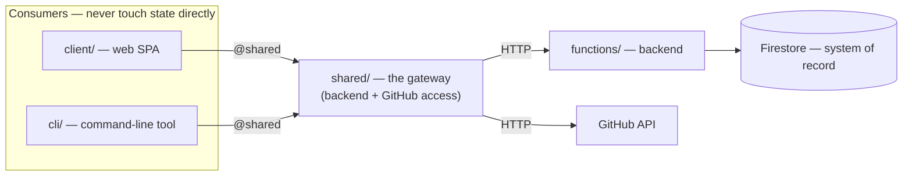

# SkillStack — Architecture

## What SkillStack is

A catalog for "skills" — folders of agent rules/instructions that live in GitHub
repositories. A **CLI** installs skills from a repo into a local project; a **web
app** browses the catalog and shows install counts. A **backend** owns all state.

## The map

```mermaid
flowchart LR
    subgraph Consumers["Consumers — never touch state directly"]
        Client["client/ — web SPA"]
        CLI["cli/ — command-line tool"]
    end

    Shared["shared/ — the gateway<br/>(backend + GitHub access)"]

    Client -->|"@shared"| Shared
    CLI -->|"@shared"| Shared

    Shared -->|HTTP| Functions["functions/ — backend"]
    Shared -->|HTTP| GitHub["GitHub API"]

    Functions --> Firestore[("Firestore — system of record")]
```

## Modules and their roles

The repo is one git tree with several **independently built** packages (each has its
own tooling; this is not an npm-workspaces monorepo

| Package      | Role                                                                                                      |
| ------------ | --------------------------------------------------------------------------------------------------------- |
| `client/`    | Presentation. A web SPA that reads the catalog. Holds no business rules and no state of record.           |
| `cli/`       | A second consumer. Orchestrates "install a repo's skills locally." Holds no state of record.              |
| `functions/` | The backend and the **only** owner of persisted state. All business rules that must be trusted live here. |
| `shared/`    | The gateway. The single place that knows how to talk to the backend and to GitHub.                        |
| `wiki/`      | Documentation (this file lives here). Not code.                                                           |

## Architecture Decision Records

Check file ./architectural-decision-records/index.md
